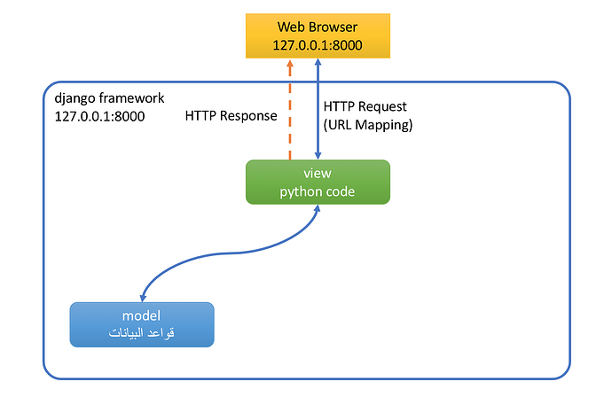
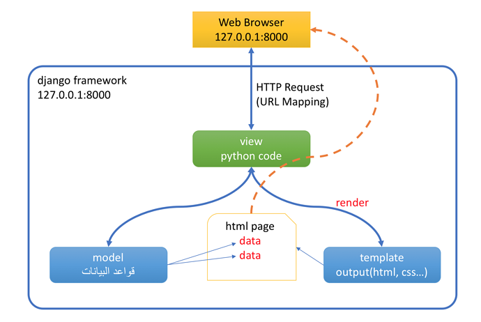

 

 
 # :house: ورشة عمل (9) التعرف على Template:

# مقدمة:
وصلنا الأن في هذه الورشة للعنصر الثالث في مثلث MTV، حيث تعرفنا على view  في ورشة 7 وتعرفنا على ال model أو قواعد البيانات databases في ورشة 8، والأن نتعرف على العنصر المكمل لكل ذلك وهو ال template الذي من خلاله نعرض معلومات بشكل منسق للمستخدم مما يسهل العرض ومن ثم القراءة من المستخدم فيما بعد :smile: .

إذا تابعتنا إلى الأن في الورشات السابقة لحد ورشة 8 تكون قد عرضت المعلومات على المتصفح من خلال ال views و  ال models عن طريق HttpResponse كما يلي:

في هذه الورشة نريد أن نفعّل ال template من خلال استخدام render بدل من  HttpResponse ونريد أن نستفيد في نفس الوقت من models ونعرض المعلومات على المتصفح كما يلي:

سأفترض في هذه الورشة أنه لديك بعض المعلومات الأساسية عن ال [HTML](https://www.w3schools.com/html/default.asp)  و ال [CSS](https://www.w3schools.com/css/default.asp)   وأنا مستعد للأسئلة حتى تتوضح الأمور.

 # :computer_mouse: شرح برنامج الورشة: 

## ما هو ال  Template ؟
ال Template هو عبارة عن طريقة عرض للمستخدم user من خلاله يستطيع المستخدم أن يتفاعل مع البرنامج عن طريق قراء البيانات والتقارير أو إدخال معلومات جديدة للبرنامج وإعطاء الأوامر، وفي أحيان كثيرة يكون لكل مستخدم صلاحيات مختلفة وبيانات خاصة به.

وبما أننا نتكلم عن برمجة المواقع الإلكترونية web فإن ال template  هنا يكون عبارة عن صفحة على المتصفح تعرض المعلومات من خلال أوامر [HTML](https://www.w3schools.com/html/default.asp) ويتم تنسيق هذا العرض عن طريق CSS. فإذا ال HTML  وال [CSS](https://www.w3schools.com/css/default.asp) هما العنصران الأساسيان لهذا ال template. وهناك أيضا مكتبات مشهورة تسهّل عملية تنسيق المعلومات على صفحة الويب ومن أشهرها ال [bootstrap](https://www.w3schools.com/bootstrap/default.asp).

ومن الممكن أن يعتمد ال template لغة ال [JavaScript](https://www.w3schools.com/js/default.asp) التي تساعد في تسهيل عملية عرض المعلومات ومعالجتها على المتصفح من غير العودة للبرنامج على السيرفر الرئيس. ولل JavaScript تطبيقات وأشكال كثيرة من ضمنها [jQuery](https://www.w3schools.com/jquery/default.asp) و [AngularJS](https://www.w3schools.com/angular/default.asp) اللذان يقومان بتسهيل عملية عرض وقراءة المعلومات على المتصفح.

## لنقوم أولا بتعريف مشروعنا على templates:

## الأن أصبح ال template جاهز لاستقبال ال model من ال view: 

## نريد أن نجمّل شكل صفحة الويب من خلال styles: 

## وتكوين صفحات ويب كثيرة لبرنامجنا أصبح أسهل مع مبدأ base.html:

## والأن سنقوم بتعديل القائمة الرئيسة للبرنامج لتكتمل الصورة: 

# تطبيق الورشة:

بحسب تتبعك للفيديوهات السابقة نريد أن نطبق الخطوات التالية:
 
•	نريد أولا أن نعرّف البرنامج الخاص بنا على templates فولدر عن طريق ملف settings.py  
•	كتابة HTML بسيط وطلبه من view عن طريق render  
•	إرسال ال model لل template عن طريق view  
•	استخدام صفحة ويب جاهزة من http://www.initializr.com/ وتعريف static فولدر  
•	إنشاء صفحة ويب للصفحة الرئيسة باسم welcome.html والاعتماد على صفحة base.html  
•	 إرسال ال model لل template عن طريق view من جديد وتفعيل القائمة الرئيسة للموقع  main menu  

هذه الورشة بها الكثير من العمل تحتاج إلى وقت جيد لكي تستوعب كافة أجزاءها، تفنن بها وخذ وقتك في فهمها وممارستها لكي ترسخ المعلومة :smile: 

