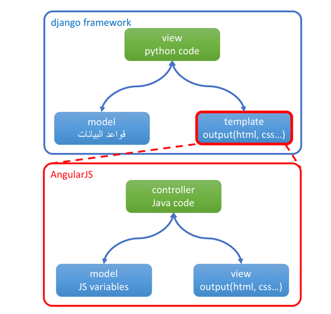

  

  
   # :house: ورشة عمل (10) التعرف على AngularJS:
  

# مقدمة:
 أي موقع على الويب يحتاج إلى أن يحمل قدرة على التفاعل مع المستخدم user على المتصفح ودائما هذا التفاعل يجب أن يحمل معه قدرة على قراءة المدخلات من المستخدم وعرض المخرجات حتى قبل أن يتم نقلها على السيرفر لأن الوصول للسيرفر مكلف من ناحية الوقت ويتحدد بسرعة الإنترنت للمستخدم.

من أجل ذلك وجدت بعض المكتبات التي تؤمن للمستخدم العمل على المتصفح بشكل محلي ولا تتصل بالسيرفر إلا إذا كان هناك داعي لنقل أو قراءة المعلومات من هناك.

## ال AngularJS:

ال AngularJS هو إحدى هذه المكتبات المتخصصة في العمل على المتصفح من ناحية المستخدم، وكما رأينا في ال django الذي قسمناه إلى ثلاثة أجزاء (Model Template View) أو MTV هنا لدى ال AngularJS نفس التقسيم مع اختلاف المسميات والتي تدعى (Model View Controller) أو MVC وهي كالتالي:

 

 والجدير بالذكر هنا أن ال AngularJS ليس جزءا من ال  django ولا يعتمد أحدهما على الأخر على الإطلاق ولكن يمكن تسخير كل واحد منهما ليعمل مع الأخر بتناغم ممتاز. بحيث يعمل ال AngularJS بشكل منفصل على المتصفح web browser ويخدم المستخدم user من خلال تسهيل قراءة البيانات وعرضها وتحويلها فيما بعد إلى السيرفر ليكمل ال django عملية معالجة وتخزين البيانات بشكل دائم على ال database.

إذا أجزاء ال AngularJS هي:
•	ال controller: هو عبارة عن جافا سكريبت وهو المسؤول عن الوصل بين ال view وال model، وهو أيضا المسؤول عن الاتصال مع السيرفر عند جاهزية البيانات لتنقل للسيرفر
•	ال view: الذي يتمثل ب HTML/CSS مدعوم AngularJS tags كما سنرى
•	ال model: وهو المسؤول عن حفظ البيانات على مستوى المتصفح من خلال JS Variables.

 # :computer_mouse: شرح برنامج الورشة: 

## تكوين أول تطبيق لل MVC على AngularJS:
من خلال الفيديو التالي سنقوم بتطبيق مبادئ ال AngularJS على برنامجنا الرئيس ونتفحّص أجزاء MVC الخاصة ب AngularJS

## قراءة مدخلات المستخدم user من خلال AngularJS directives  :
المزيد من AngularJS tags من خلال هذا الفيديو

## ترتيب الكود قبل المتابعة:
نقل scripts إلى ال static folder:

# تطبيق الورشة:

بحسب تتبعك للفيديوهات السابقة نريد أن نطبق الخطوات التالية:

    تكوين برنامج AngularJS داخل مشروعنا HotelReservation
    فصل ال JavaScript في ملف تحت فولدر static
    قراءة المدخلات من المستخدم والتعديل المباشر على القائمة المعروضة

في الورشة القادمة إن شاء الله سنرى كيفية تعامل ال django مع Angular لعرض المعلومات والإضافة من واجهة المستخدم حتى التخزين في قاعدة البيانات :smile:.

بالتوفيق للجميع  :smile:

  

