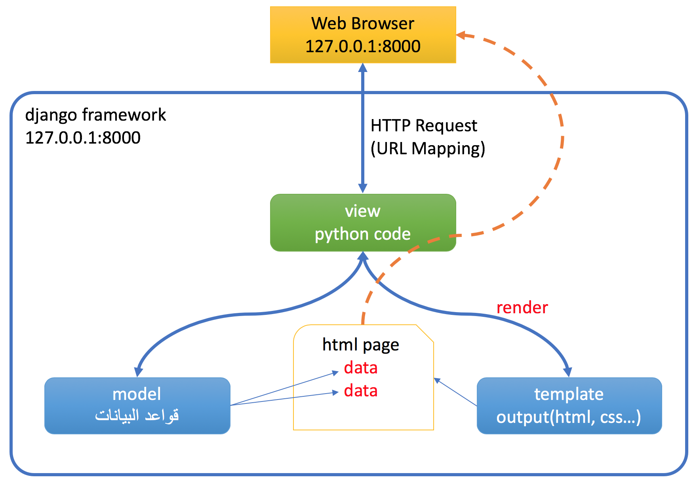
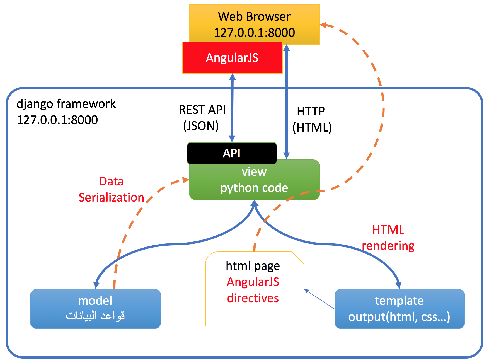
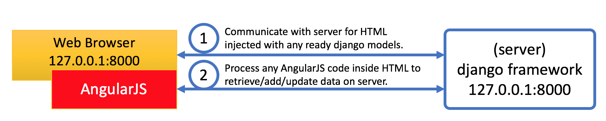

  

 # :house: ورشة عمل (11) التعرف على REST:

# مقدمة:
 من المفيد أن يتعامل عدة  frameworks مع بعضها البعض، وكما رأينا في الورشة السابقة أن AngularJS يعمل بشكل ممتاز من ناحية المتصفح ويخدم المستخدم user بشكل سلس، ولكن لم نربط بعد ال django مع AngularJS.

لكي نقوم بعملية الربط، والتي هي ليس عملية مباشرة أي أن ال django لن يعرف بوجود ال AngularJS ونفس الشيء بالنسبة لل AngularJS، ولكن تعبير "ربط" هنا يعني أن نجعل كل واحد من هذه الأدوات جاهز لأن يتعامل مع العالم الخارجي، ف django يجب أن يستعد لأن يعطي البيانات التي لديه والتي هي على شكل python objects والتي تمت قراءتها من قاعدة بيانات، ولكي يقوم بذلك يجب أن يهيئ هذه البيانات بشكل يسهّل قراءتها للأدوات خارج django، ونفس الشيء لل AngularJS، يجب أن يملك القدرة على أن يقرأ من أدوات ولكن بالشكل الذي يلائمه كونه JavaScripts.

## شكل البيانات:
أولا لنتحدث عن شكل البيانات، يجب أن يكون هناك طريقة متعارف عليها ومدعومة من قبل كل الأدوات التي تود أن تتبادل البيانات فيما بينها، في حالتنا هنا ال django وال AngularJS، وكوننا نريد أن نعرض هذه البيانات على المتصفح أي من خلال JavaScript فإن JSON أو Java Script Object Notation هو الوسيلة الممتازة لهذه العملية، حيث تقوم JSON على وضع البيانات على شكل نص أي ممكن أن يقرأ من أي محرر نصوص ولكن بشكل منظم أي أن البيانات تم تشكيلها على هيئة objects، للمزيد عن JSON https://www.w3schools.com/js/js_json_intro.asp.

فإذاً اعتمدنا طريقة تشكيل البيانات، أي أن ال django يجب أن يقوم بتحضير ما يملك من بيانات على شكل JSON ثم AngularJS سيقوم بعرضها على المتصفح، وبالنسبة ل AngularJS فإن JSON معرّفه عنده بشكل تلقائي، ولكن كيف سيقوم ال  django بتحويل البيانات إلى JSON؟

## تسلسل البيانات أو Serialization:
مصطلح تسلسل Serialization يعني أن نحوّل شكل البيانات من وضع لوضع أخر، وهي الأن موجودة داخل قاعدة البيانات ،ممثلة ب python objects والتي من السهل على django أن يقرأها، ولكن يجب عليه أي ال django أن يقوم بسلسلة هذه البيانات على شكل JSON وجعلها جاهزة للنقل للعالم الخارجي وفي حالتنا جعلها جاهزة لل AngularJS. 

## طريقة الاتصال RESTfull APIs:
بعد أن تم تجهيز البيانات للنقل على شكل JSON، بقي أن نتعرف على وسيلة النقل، وبما أننا نتكلم عن الويب فستظهر مباشرة تقنية ال RESTful  https://en.wikipedia.org/wiki/Representational_state_transfer والتي من خلالها سيتم الحديث بين ال AngularJS وال django لغرض نقل البيانات ذهابا وإيابا.

## فهم الصورة كاملة:
قد رأينا في الورشة رقم 7 ال django وال MTV الخاص به وكيف أن ال django يقوم بتحضير البيانات على السيرفر ثم إرسالها على شكل HTML للمتصفح، كما يلي:

في حالة إضافة ال AngularJS ستبقى آلية ال MTV نفسها لل django بحيث يقوم بإرجاع HTML  قد تحتوي على بيانات من السيرفر (database) وفي نفس الوقت ستحتوي هذه ال HTMLs وال JavaScripts على AngularJS directives و AngularJS code الذي بدوره سيقوم بعرض المعلومات وأيضا قد يطلب البيانات من السيرفر من جديد كما سنرى، والصورة التالية تعبّر عن دور ال AngularJS:

وإذا أردنا أن نرتّب الأمور فهي كما يلي:

بحيث يبدأ عمل ال  django على السيرفر ويعيد ال HTML و ال JavaScript للمتصفح، عندها يبدأ عمل ال AngularJS الذي يقوم بتشغيل منظومة MVC التي تحدثنا عنها في الورشة رقم 10 لمعالجة وعرض المعلومات والذي سيتصل بدوره من جديد مع السيرفر للمزيد من قراءة البيانات.

قد تتساءل هنا لما نريد ال AngularJS نستطيع أن نعتمد على ال django لإرجاع كل البيانات التي نريد، لما نريد أن نعود من جديد للسيرفر بعد عرضنا لصفحة ال HTML على المتصفح؟ أحد الأجوبة الواضحة هو أن ال AngularJS يسهّل التعامل مع المستخدم ويسهل عرض البيانات الواردة من السيرفر على المتصفح.

هذه هي المقدمة لنرى الأن التنفيذ .

 # :computer_mouse: شرح برنامج الورشة: 

## تحضير البيانات على شكل JSON من خلال Serialization:
من خلال الفيديو التالي سنقوم بتجهيز ال python objects التي تتمثل بقائمة بالبيانات الواردة من قاعدة البيانات على شكل JSON: 

## تحضير ال API لنقل البيانات:
من خلال الفيديو التالي سنقوم بتحضير ال APIs لنقل البيانات من ال django لل AngularJS:

## قراءة البيانات من خلال ال AngularJS:
الأن جاء دور ال AngularJS لقراءة البيانات الواردة من django عن طريق ال APIs:

## تجهيز ال API لتستقبل ال delete وال post من AngularJS:
سنقوم بالمزيد من تحضير الكود في django ليستقبل أوامر الإضافة post والإلغاء  delete من خلال الفيديو التالي:

## توصيل ال AngularJS بال API الخاصة ب ال delete وال post:
وأخر خطوة هي ربط ال AngularJS بعمليات الإضافة والحذف:

# تطبيق الورشة:

لقد قمنا بالكثير من العمل في هذه الورشة، أرجو منك أن تتطبق كافة الخطوات وتتأكد أنها تعمل بشكل صحيح ثم من بعد ذلك يجب عليك أن تتابع في الخطوات اللاحقة أي آن تفعل نفس الشيء مع customers و reservations وأيضا تقوم بتطبيق ال put التي تؤدي إلى التعديل على البيانات :smile:.

بالتوفيق للجميع  :smile:
  

