<h2>

:construction: ورشة عمل (4) البدء بمشاركة الكود على GitHub 

</h2>

<h2>

:computer_mouse: شرح برنامج الورشة:

</h2>

من المهم أن تتعرف على طريقة حفظ إصدارات الكود المختلفة حتى تتابع تقدمك في أي مشروع وخصوصا في الورش التي نعمل عليها حاليا. في هذه الورشة سنقوم بحفظ ملفات برنامجنا على مستودع بعيد لكي يسهل علي متابعة تقدمكم.

<h3>

:page_with_curl: ملف البرنامج:

</h3>

في الورشة السابقة تكوّن عندنا مجموعة ملفات، حان الوقت لإدخال إدارة الإصدارات لمشروعنا الصغير :smile: 

  •	hotel.py
  • customer.py
  • reservation.py
  •	notification.py
  •	tester.py
  • main.py

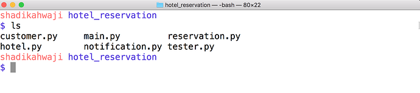

<h2>

:wrench:  تطبيق الورشة

</h2>

في هذه الورشة سنقوم بإضافة ملفات برنامجنا على مستودع محلي local repo ثم سنقوم بترحيل الملفات إلى مستودع بعيد على GitHub: 

<h3>

إنشاء مستودع repo محلي:

</h3>

أولا انتقل إلى الفولدر الخاص بالمشروع الذي عملت عليه في الورشات السابقة:
ومن ثم يجب أن ننشئ مستودع محلي local repo  عن طريق الأمر التالي:

    git init

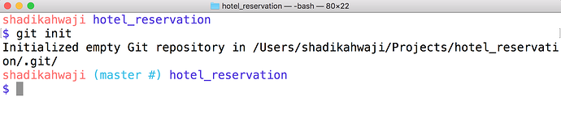

<h3>

إضافة ملفات البرنامج للمستودع المحلي local repo:

</h3>

إذا يجب أن ننفذ إضافة الملفات عن طريق الأمر:

    git add . 

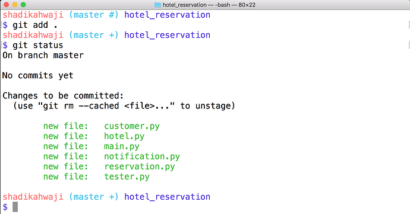

إذا كان هناك  ملفات لا تريد أن تشملها من ضمن الأمر السابق مثل ملفات التوثيق documents أو ملفات نصوص عادية ليس لها علاقة بالكود يمكن إضافتها ل ملف .gitignore

بعد إضافة الملفات أصبحنا جاهزين لتثبيت الملفات على المستودع المحلي عن طريق:

    git commit -m “initial commit”

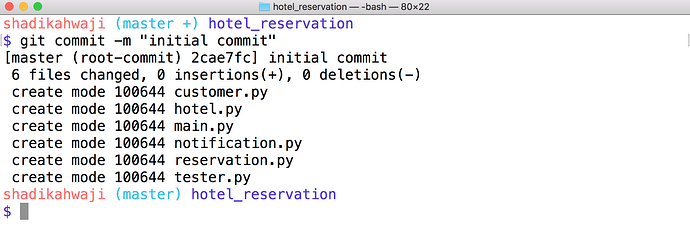

<h2>

: العمل مع المستودعات البعيد

</h2>

 حان الوقت لنتعرف على توأم جت git ألا وهو GitHub، وهو موقع على الأنترنت يتيح لك من خلال أوامر جت أن تضع تاكود الخاص بك على الإنترنت لتشاركه مع الجميع لأغراض مختلفة.
    

يجب أن نحصل أولا على حساب على جت هب، لإنشاء حساب لك على GitHub إذا لم تكن أنشأت واحدا من قبل تابع الفيديو التالي:

<iframe width="560" height="315" src="https://www.youtube.com/embed/pJ6RGrdb_uw?rel=0" frameborder="0" allow="autoplay; encrypted-media" allowfullscreen></iframe>

 الأن أصبحنا جاهزون لنقوم بتكوين أول مشروع لنا على GitHub من خلال الخطوات التالية:

<h4>

 اختر Start a project من الصفحة الرئيسية أو إذا كان لديك مشاريع سابقة فقط اضغط على New repository من الصفحة الرئيسية لحسابك: 

</h4>

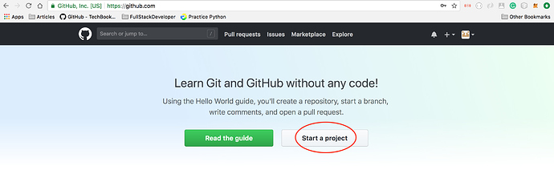

 <h4>

 سيطلب منك اسم المشروع، فقط زوده باسم المشروع بدون أي خيارات أخرى ثم اضغط على Create repository:

</h4>

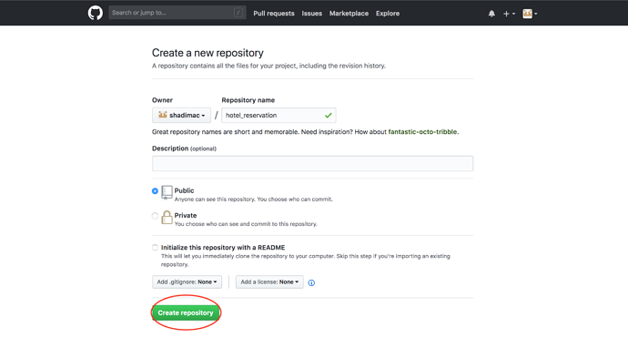

بعدها ستجد صفحة المشروع الجديد ولأنه فارغ سيعطيك بعض المعلومات لكي تبدأ، إختر HTTPS  كوسيلة للتواصل مع المشروع:

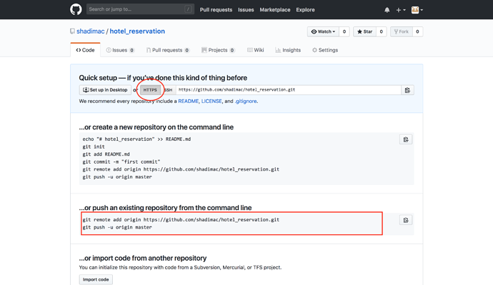

    وبما إننا لدينا مستودع Repo موجود على فما علينا إلا أن نربط هذا المستودع من GitHub مع المستودع المحلي     Local Repo الذي لدينا عن طريق تنفيذ الأوامر في الصورة أعلاه، طبعا هذه الأوامر لها علاقة بحسابي، يجب عليك أن تنفذ الأوامر الخاصة بك.

    توجه للمستودع الذي قمت بعمله في وقم بفحص إذا كان مستودعك مرتبط بأي مستودع على الإنترنت Remote Repo:

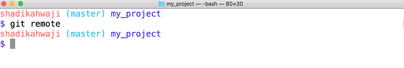

إذا لم يظهر شيء بعد أمر git remote تستطيع أن تتأكد بأن المستودع المحلى الذي لديك غير مرتبط بأي مستودع على ال GitHub أو أي سيرفر أخر.
نستطيع الأن أن ننفذ الأوامر التي نسخناها من مشروعنا الجديد على GitHub هذ الأمر سيقوم بربط مستودعنا المحلي مع المستودع البعيد remote repo:

    git remote add origin https://github.com/shadimac/hotel_reservation.git

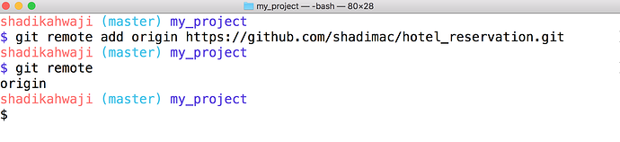

الأن بعد الربط  نرى أنه أصبح لدينا فرع جديد يدعى origin:

نستطيع أن نتأكد من إضافة المستودع من على Remote Repo علي مستودعنا المحلي Local Repo عن طريق الأمر التالي:

    git log --oneline

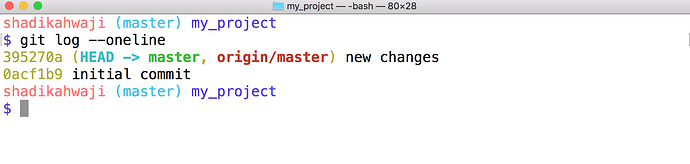

ما علينا الأن إلا أن نرسل كافة الملفات التي لدينا من المستودع المحلي إلى المستودع البعيد لغرض تخزينها هناك:

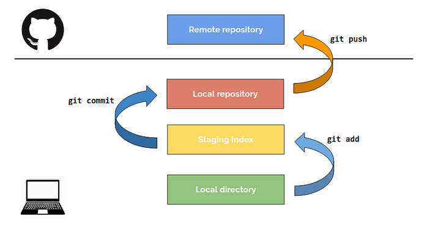

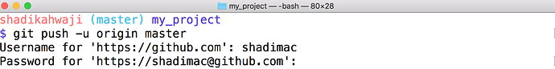

لن يتم دفع الملفات إلى المستودع البعيد إلا بعد أن يحصل منك على إسم المستخدم وكلمة السر لحسابك على ال GitHub:

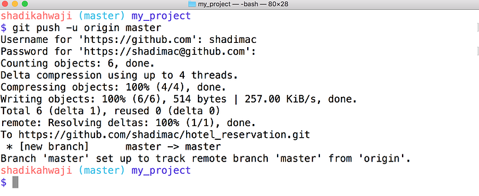

هنا تم قبول أمر رفع الملفات على GitHub ولنتأكد من ذلك نستطيع أن نذهب لموقع GitHub ونتأكد من ذلك فسنجد الملفات مدرجة هناك:

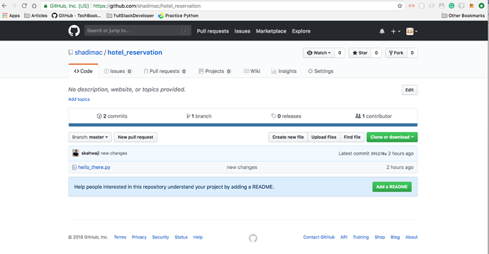

بهذا أصبحت ملفاتك كلها موجودة على GitHub وتستطيع أن تشاركها مع الجميع، بقي أن تعرف في حين أحدثت تعديل على المستودع المحلي Local Repo ما عليك إلا أن تنفذ الأمر التالي لنقل الملفات إلى المستودع البعيد Remote Repo

    git push -u origin master

<h3>

أتمنى التوفيق للجميع من كل :heart: :blush:

</h3>
