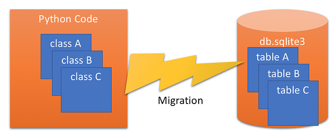
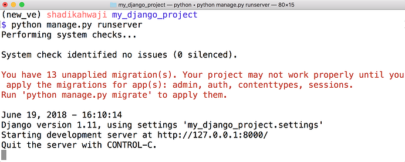
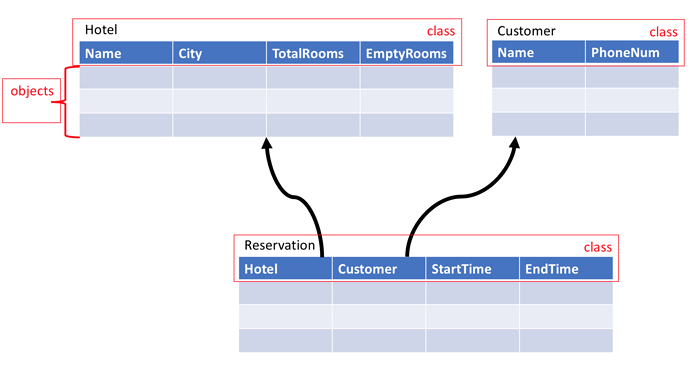

 # :house: ورشة عمل (8) بناء قاعدة بيانات (Database) باستخدام Model

# مقدمة:
إلى الأن نحن نخزن كل المعلومات في قوائم في الذاكرة وذلك لن يفيد في عمل برنامج متكامل، في هذه الورشة سنتعرف على كيفية تخزين معلوماتنا في قواعد للبيانات لنقوم باسترجاعها لاحقا والتعديل عليها عند الحاجة لذلك.

سأفترض في هذه الورشة أنه لديك بعض المعلومات الأساسية عن قواعد البيانات، مثل table و field وأنا مستعد للأسئلة حتى تتوضح الأمور.

 # :computer_mouse: شرح برنامج الورشة: 

## ما هو ال Model ؟
ال Model هو عبارة عن class من خلاله سنحدد ما هي المعلومات التي نريد أن نخزنها في قاعدة البيانات، كل model  يمثّل table في قاعدة البيانات، وكل متغير داخل ال Model يمثل field في هذا ال table.

بما أن ال Model عبارة عن class إذا أي نسخة منه object  هي عبارة عن row جديد في ال table. ف ال Model سيشكل هيكل ال table وال object  أو instanceسيشكل سطر أو بيانات مخزنة في هذا ال table. سنرى ذلك بالتفصيل لاحقا.

## ما هو ال Migration؟
عندما نتكل على أن ال Model سيمثل قاعدة البيانات فيجب أن ننشئ قاعدة البيانات بناء على هذا ال Model وفي نفس الوقت من الممكن أن نقوم بتغيير ال Model بعد إنشاء قاعدة البيانات مما يحتم علينا أن نقوم بتحديث قاعدة البيانات بالتغييرات التي حصلت غير ذلك لن يقوم الكود بالعمل بالشكل الصحيح. هذه العملية التي تحوّل ال Model من class إلى table تسمى Migration.

وال django سيقوم بتذكيرك بأن هناك Models لم يتم تحويلهم لقاعدة البيانات وذلك عند تشغيل البرنامج:

 
لاحظ الرسالة بالأحمر التي تنبهك لوجود Models لم يتم نقلها، وهذه ال  13 Migrations التي يخبرنا عنها ال django  لم نقم بها نحن وإنما هي أتت مع برنامج ال django ولا تهمنا الأن.

## إنشاء App جديد:
تتكون مواقع الويب من صفحات كثيرة وقد يكون هناك حاجة لترتيب هذه الصفحات وما يتعلق بها تحت فولدر منفصل أو package، هذا الفولدر المنفصل يدعى App ويتم إنشاؤه من خلال الأمر التالي:

    python manage.py startapp reservation

الفيديو التالي يوضح إنشاء أول app :

## كتابة ال Models:
دعونا الأن نكتب ال Models وستكون عبارة عن classes موجودة في ملف بايثون يسمى models.py الذي ستجده من ضمن ال app الجديد الذي أنشأناه. 

هذه هي الtables التي نريد أن نتعامل معها من خلال نظام حجز الفنادق:

 
لاحظ العلاقة بين جدول ال Reservation وجدولي Hotel و Customer، سنرى كيف نفعل ذلك من خلال ال Models. 

من خلال الفيديو التالي سنقوم بإنشاء ال Models التي لدينا: 

## إجراء ال migration:
كنا قد عرّفنا كل ال models التي لدينا، الأن يجب أن نقوم بنقلهم وإنشاء tables داخل قاعدة البيانات التي لدينا في ال sqllite، تابعنا في الفيديو التالي لنفعل ذلك:

## إدارة ال Models من خلال مدير البرنامج  Admin:
أولا يجب أن نقوم بتسجيل ال Models التي لدينا ليتعرف عليها مدير البرنامج Admin وذلك من خلال ملف admin.py الموجود داخل ال app الجديد الذي تم إنشاءه، ثم نستطيع أن ننشئ اسم مستخدم رئيسي لديه الصلاحيات، ثم سندخل بعض المعلومات عن الفنادق والعملاء وحجوزاتهم. تابع الفيديو:

## ملاحظة: أنا قمت بتفعيل auto save للملفات على VSC لذلك تأكد من تخزين الملفات عند كل تعديل :smile: 

## تعديل views.py للوصول لقاعدة البيانات:
هنا سنتخلص من الملفات التي عملنا عليها في الورش السابقة :(  والموجودة في فوادر controllers وسنستبدلها بال Models التي تمثل قاعدة البيانات. لنتابع الفيديو :smile:  

# تطبيق الورشة:
في الورشة السابقة تعرفنا على ال view والأن نتعرف عن طريق الفيديوهات السابقة ما معنى ال Model الذي هو جزء من ال MTV. نريد أن نبدأ بالتطبيق لترسخ المعلومة.

## إنشاء app جديد:
أولا يجب أن نفعّل البيئة الإفتراضية:

    . hr_env\bin\activate

طبعا إذا كنت على ويندوز يحتاج Scripts بدل bin، راجع الورشة السابقة.

الأن نريد أن ننشىء app جديد تحت hotel_system الذي يحتوي على ملف manage.py:

    python manage.py startapp reservation
    

    

## تعديل ملف urls.py تحت hotel_system:

    from django.conf.urls import url, include
    from django.contrib import admin
    from .views import WelcomePage

    urlpatterns = [
        url(r'^admin/', admin.site.urls),
        url(r"reservation/", include("reservation.urls")),
        url(r"", WelcomePage) 
    ]

## إنشاء ملف جديد تحت reservation باسم urls.py:

    from django.conf.urls import url

    from .views import AllHotels

    urlpatterns = [
       url(r"allhotels", AllHotels)
    ]

## إضافة المشروع الجديد settings.py:

    INSTALLED_APPS = [
        'django.contrib.admin',
        'django.contrib.auth',
        'django.contrib.contenttypes',
        'django.contrib.sessions',
        'django.contrib.messages',
        'django.contrib.staticfiles',
        'reservation'
    ]

## إضافة لملف ال views.py:

    from django.http import HttpResponse

    def AllHotels(request):
        return HttpResponse(“You are inside the app”)

يجب الأن أن تقوم بتنفيذ البرنامج وتفحص بأن ال reservation app يعمل بشكل صحيح مع البرنامج.

## إلغاء ملفات المشروع السابقة:
يجب أن نلغي ملفاتنا من الورشات السابقة ال classes الموجودة في controllers لقد تعلمنا خلال إنشائها ولكن الأن لم يعد لها مكان :smile: 

## إضافة الجداول tables من خلال ال models.py:

سأترك لك هذا القسم لتقوم بكتابة ال models من جديد، يمكنك أن تعود للفيديو Models - Create Models Classes في الأعلى :smile: 

## تنفيذ ال migration:
الأن أصبحنا جاهزين لتنفيذ ال migration لتحويل ال classes إلى tables على قاعدة البيانات:

١. تحضير ال  migration:

    python manage.py makemigrations   

٢. تحديد ال migration ل sqllite:

    python manage.py sqlmigrate reservation 0001

٣. تنفيذ ال migration:

    python manage.py migrate

## إنشاء إسم مستخدم لإدارة الموقع:

    python manage.py createsuperuser

## تسجيل الجداول model tables حتى يظهروا في شاشة إدارة الموقع على ملف admin.py مع reservation app :

    from .models import Hotel, Customer, Reservation

    admin.site.register(Hotel)
    admin.site.register(Customer)
    admin.site.register(Reservation)

## إضافة بيانات للجداول من خلال مدير الموقع admin:

الأن يمكنك أن تبدأ بإضافة بيانات للجداول tables التي أنشئناها بإستخدام إسم المستخدم لإدارة الموقع:

    python manage.py runserver

 ثم توجه لعنوان إدارة الموقع:

    http://127.0.0.1:8000/admin/

قم بإضافة `__str__` لل models حتى يتنسنى لك أن ترى إسم المدخلات في كافة الجداول، قم بتتبع فيديو Models - Configure Admin في الأعلى.

## تعديل  views.py تحت  reservation:

    from django.http import HttpResponse
    from .models import Hotel

    def AllHotels(request):
        all_hotels = "<ul>"
        for hotel in Hotel.objects.all():
        all_hotels = all_hotels + "<li>" + hotel.hotel_name + "</li>"
        all_hotels += "</ul>"

        return HttpResponse(all_hotels)

ثم من خلال المتصفح تنقّل عن طريق طباعة العناوين التالية:

    python manage.py runserver

    http://127.0.0.1:800/admin/
    http://127.0.0.1:800/reservation/allhotels

بقي أن تطبق باقي ال views لتعرض الروابط التالية:

    http://127.0.0.1:800/reservation/hotelincity
    http://127.0.0.1:800/reservation/reservationlist

هذه الورشة تحتاج إلى وقت جيد لكي تستوعب كافة أجزاءها فخذ وقتك في فهمها وممارستها لكي ترسخ المعلومة :smile: 
